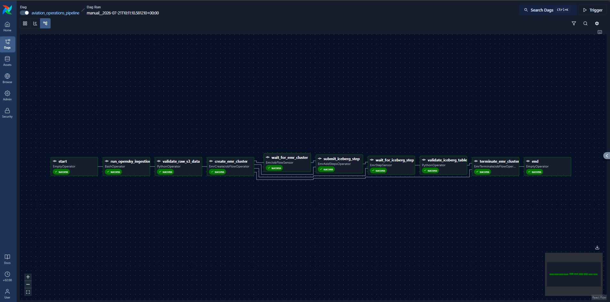
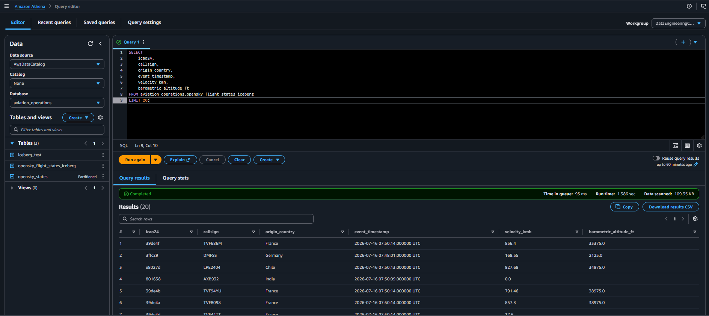
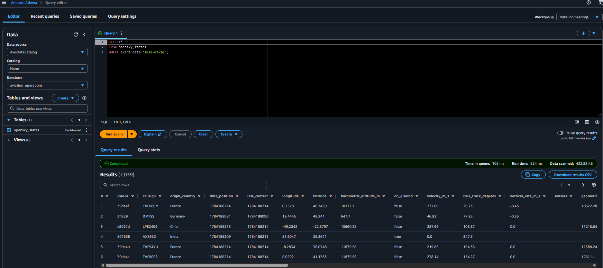
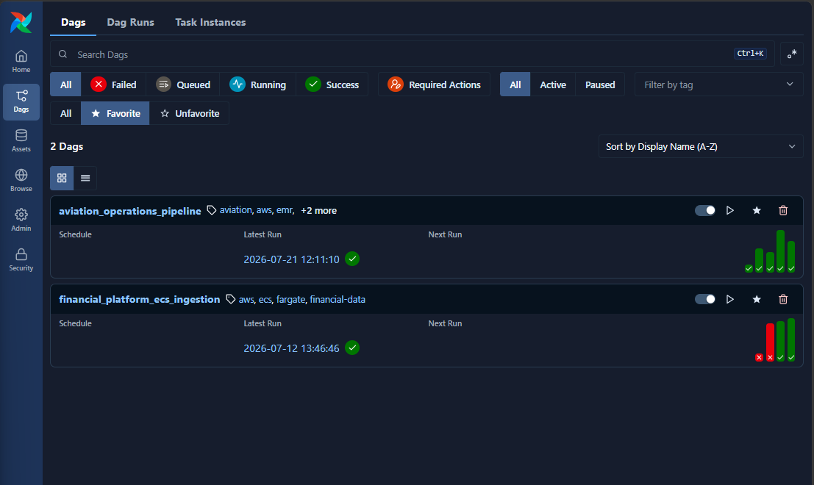
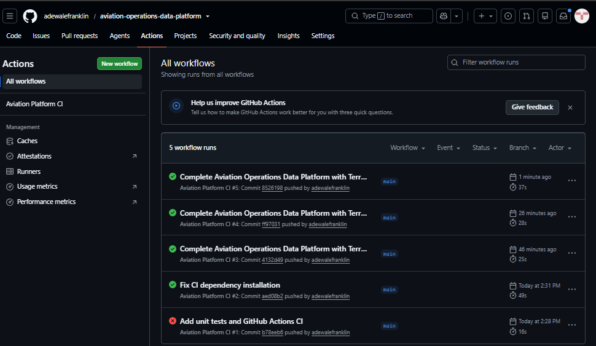

# Aviation Operations Data Platform

An end-to-end cloud-native data engineering platform built on AWS that ingests live aircraft state data from the OpenSky Network API, stores immutable raw data in Amazon S3, transforms it using Apache Spark on Amazon EMR, writes curated datasets as Apache Iceberg tables, catalogs metadata with the AWS Glue Data Catalog, queries data using Amazon Athena, and orchestrates the entire workflow with Apache Airflow.

---

# Project Overview

This project demonstrates how to design and implement a modern cloud-native data platform capable of ingesting, processing, cataloging, and serving aviation telemetry data using a scalable ELT architecture.

The platform applies production-oriented data engineering practices, including:

- OAuth2-secured API ingestion
- Immutable raw data storage in Amazon S3
- Distributed data processing with Apache Spark on Amazon EMR
- Data quality validation before curation
- Apache Iceberg for ACID-compliant analytical tables
- Metadata management with the AWS Glue Data Catalog
- Serverless SQL analytics with Amazon Athena
- Workflow orchestration using Apache Airflow
- Infrastructure provisioning with Terraform
- Least-privilege IAM security
- Automated provisioning and termination of compute resources to optimise cloud costs

---

# Technology Stack

| Category | Technologies |
|-----------|-------------|
| Programming | Python 3 |
| Cloud Platform | Amazon Web Services (AWS) |
| Infrastructure as Code | Terraform |
| Data Lake | Amazon S3 |
| Distributed Processing | Amazon EMR |
| Processing Engine | Apache Spark |
| Table Format | Apache Iceberg |
| Metadata Management | AWS Glue Data Catalog |
| Workflow Orchestration | Apache Airflow |
| Query Engine | Amazon Athena |
| Authentication | OAuth2 Client Credentials |
| Monitoring | Amazon CloudWatch |
| Version Control | Git & GitHub |
| CI/CD | GitHub Actions |
| Containerisation | Docker |

---

# Project Structure

```text
aviation-operations-data-platform/
│
├── airflow/
│   └── aviation_operations_pipeline.py
│
├── docs/
│   ├── architecture-decisions/
│   ├── architecture/
│   └── screenshots/
│
├── scripts/
│   ├── emr/
│   │   └── states_to_iceberg.py
│   └── ingestion/
│
├── src/
│   ├── authentication/
│   ├── extract/
│   ├── load/
│   ├── pipeline/
│   └── config/
│
├── terraform/
│   ├── data.tf
│   ├── iam.tf
│   ├── outputs.tf
│   ├── provider.tf
│   ├── variables.tf
│   ├── versions.tf
│   └── terraform.tfvars.example
│
├── tests/
│
├── .github/
│   └── workflows/
│       └── ci.yml
│
├── Dockerfile
├── requirements.txt
├── requirements-dev.txt
└── README.md
```

---

# Pipeline Architecture

```text
                         Terraform
               Infrastructure as Code
          IAM Roles • Policies • Glue • EMR
                         │
                         ▼

                 OpenSky Network API
                         │
                         ▼
              Python Ingestion Pipeline
          OAuth2 Authentication • Extract • Load
                         │
                         ▼
           Amazon S3 Raw Landing Zone
        Raw JSON partitioned by year/month/day/hour


===========================================================
          Apache Airflow Workflow Orchestration
     Scheduling • Dependencies • Retries • Monitoring
===========================================================

                         │
                         ▼
               Validate Raw S3 Data
                         │
                         ▼
                Create EMR Cluster
                         │
                         ▼
           Apache Spark on Amazon EMR
                         │
                         ▼
        Clean • Validate • Type • Transform
                         │
                         ▼
          Amazon S3 Processed Data Zone
                    Parquet Files
                         │
                         ▼
               Apache Iceberg Table
          Snapshots • Schema • Table Metadata
                         │
                         ▼
              AWS Glue Data Catalog
                         │
                         ▼
                  Amazon Athena
                         │
                         ▼
             SQL Analytics / BI Tools
```

---

# Data Pipeline

## Step 1 — Authentication

The platform authenticates against the OpenSky Network API using the OAuth2 Client Credentials flow.

---

## Step 2 — Data Extraction

Aircraft state vectors are extracted from the OpenSky Network API.

Each API response contains:

- Response timestamp
- Aircraft state vectors
- Position
- Velocity
- Altitude
- Heading
- Flight identifiers
- Additional aircraft metadata

---

## Step 3 — Raw Data Storage

The original API response is stored unchanged inside Amazon S3.

Example:

```text
raw/
└── opensky/
    └── states/
        └── year=2026/
            └── month=07/
                └── day=21/
                    └── hour=07/
```

The platform follows an ELT architecture by preserving the original source data before any transformation.

---

## Step 4 — Airflow Orchestration

Apache Airflow orchestrates the complete workflow.

```text
Start

↓

Run OpenSky Ingestion

↓

Validate Raw S3 Data

↓

Create EMR Cluster

↓

Wait for EMR

↓

Submit Spark Job

↓

Wait for Spark Completion

↓

Validate Iceberg Table

↓

Terminate EMR Cluster

↓

End
```

---

## Step 5 — Spark Processing

Amazon EMR executes Apache Spark to:

- Read raw JSON from Amazon S3
- Explode aircraft state arrays
- Validate records
- Reject malformed records
- Transform positional arrays into analytical columns
- Generate business keys
- Calculate payload hashes
- Produce analytics-ready datasets

---

## Step 6 — Data Quality Validation

The platform validates:

- State vector length
- Missing values
- Invalid aircraft records
- Schema consistency

Rejected records are written to a dedicated Amazon S3 location for auditing and troubleshooting.

---

## Step 7 — Apache Iceberg

Apache Spark writes the curated dataset into Apache Iceberg.

The platform supports:

- ACID transactions
- Schema evolution
- Time travel
- Hidden partitioning
- Incremental MERGE operations

---

## Step 8 — AWS Glue Data Catalog

The Iceberg table is automatically registered in the AWS Glue Data Catalog.

This enables downstream services such as Amazon Athena to discover and query the dataset without additional configuration.

---

## Step 9 — Query Layer

Amazon Athena queries the Apache Iceberg tables directly from Amazon S3 without requiring data movement into a traditional data warehouse.

---

## Step 10 — Infrastructure Management

Terraform provisions and manages the AWS infrastructure used by the platform.

Managed infrastructure includes:

- EMR IAM Role
- EMR Instance Profile
- EMR Data Access Policy
- Imported AWS Glue Database
- Existing Amazon S3 Data Lake reference

The project demonstrates:

- Infrastructure as Code
- Resource import
- Data sources
- Idempotent deployments
- Least-privilege IAM design

---

# Repository Highlights

## Python

- Object-Oriented Design
- Modular architecture
- Logging
- Exception handling
- Configuration management
- Environment variable management

---

## AWS

- Amazon S3
- Amazon EMR
- AWS Glue Data Catalog
- Amazon Athena
- AWS IAM
- Amazon CloudWatch

---

## Data Engineering

- ELT Architecture
- Distributed Processing
- Apache Spark
- Apache Iceberg
- Data Quality Validation
- Idempotent Processing
- Partitioned Data Lake Design

---

## Infrastructure as Code

- Terraform
- Imported Infrastructure
- Data Sources
- IAM Provisioning
- Least-Privilege Security
- Idempotent Infrastructure Deployment

---

## Workflow Orchestration

- Apache Airflow DAGs
- EMR Lifecycle Automation
- Pipeline Validation
- Automatic Cluster Termination

---

## CI/CD

- GitHub Actions
- Automated Formatting Checks
- Automated Unit Testing
- Continuous Integration Pipeline

---

# Screenshots

## End-to-End Workflow



---

## Apache Iceberg Table



---

## Amazon Athena Query



---

---

## Airflow Dags Overview



---

## Github Actions Overview



---


# Key Features

- OAuth2 API Authentication
- ELT Data Pipeline
- Immutable Raw Data Storage
- Distributed Apache Spark Processing
- Apache Iceberg Data Lake
- AWS Glue Data Catalog Integration
- Data Quality Validation
- Idempotent MERGE Processing
- Apache Airflow Workflow Orchestration
- Automated EMR Cluster Lifecycle Management
- Infrastructure as Code with Terraform
- GitHub Actions Continuous Integration

---

# Learning Outcomes

This project demonstrates practical implementation of:

- Cloud-native Data Engineering
- Infrastructure as Code with Terraform
- Distributed Data Processing
- Modern Data Lake Architecture
- Workflow Orchestration
- Infrastructure Cost Optimisation
- Apache Iceberg Implementation
- Metadata Management with AWS Glue
- IAM Least-Privilege Design
- Production-ready Pipeline Design

---

# Future Enhancements

- Deploy Airflow using Amazon MWAA
- Incremental partition optimisation
- Automated infrastructure deployment pipeline
- End-to-end monitoring dashboards
- Production-grade alerting with CloudWatch and SNS